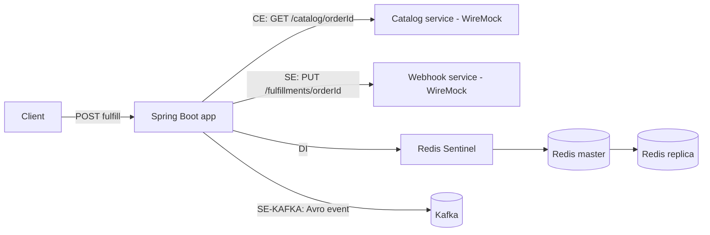

# REOF Golden Demo

A deliberately microscopic Java/Spring Boot service designed as a **positive-control repository for the REOF MS-1.1 structural resilience audit**.

Its purpose is not to be a production starter kit. It is an executable reference fixture where every resilience mechanism intended to be scored by REOF is explicit in code or configuration, easy to locate, and reproducible.

## What this repository demonstrates

There is one application, one business capability, and one public route:

```text
POST /api/orders/{orderId}/fulfill
```

The single order-fulfillment flow crosses every REOF MS-1.1 vertical:

| REOF vertical | Interaction point | Protections demonstrated |
|---|---|---|
| **EE** | HTTP entry | semaphore bulkhead |
| **CE** | synchronous catalog lookup | timeout, pool, circuit breaker, local fallback, exponential retry + jitter + attempt cap + global retry budget |
| **SE** | fulfillment webhook | timeout, pool, circuit breaker, fallback, retry, idempotent `PUT` + `Idempotency-Key`, gzip, bounded async dispatch |
| **DI** | Redis order state | master/replica replication, Sentinel, timeout, pool, local fallback |
| **AC** | application/container | specific readiness, specific liveness, startup probe, self-healing, graceful shutdown, CPU/memory requests+limits, PDB |
| **SE-KAFKA** | fulfillment event producer | Avro schema validation, explicit bounded failure path, throttling, producer idempotence, bounded batch, `acks=all` |

See [`REOF-MAP.md`](REOF-MAP.md) for the expected evidence inventory and resolved values.

## Architecture



The two WireMock containers represent **external HTTP dependencies**. They are deliberately outside the Spring Boot application boundary and can be replaced with real services by changing environment variables. Redis and Kafka are also real network dependencies from the application's point of view.

This gives the fixture two reproducible modes:

1. **Healthy path** — all dependencies are available and the complete flow executes.
2. **Failure path** — the external HTTP mocks are stopped and the business API continues through retry, circuit breaker, and fallback.

## Requirements

For the complete demo:

- Docker with Docker Compose v2
- `curl`

For Java-only development:

- Java 21
- Maven 3.9+

You do not need Maven installed to run the Docker demo because the `Dockerfile` uses a Maven build stage.

## Quick start

```bash
git clone https://github.com/RudsonCarvalho/reof-golden-demo.git
cd reof-golden-demo
docker compose up -d --build
```

The stack starts:

```text
Spring Boot application
Catalog WireMock
Webhook WireMock
Redis master
Redis replica
3 Redis Sentinels
Kafka
```

Run the healthy-path check:

```bash
./scripts/smoke-test.sh
```

The script waits for **real readiness**, calls the order endpoint twice, proves Redis read-back, and uses the WireMock admin APIs to prove that both external HTTP integrations were actually called.

A typical response is:

```json
{
  "orderId": "reof-smoke-001",
  "catalogSource": "catalog-mock",
  "stateSource": "redis",
  "webhookStatus": "DISPATCHED",
  "kafkaStatus": "PUBLISHING"
}
```

Stop the stack with:

```bash
docker compose down -v
```

## Call the API manually

```bash
curl -X POST http://localhost:8080/api/orders/order-123/fulfill
```

The HTTP dependencies are exposed on the host for inspection:

```text
Catalog WireMock: http://localhost:8081
Webhook WireMock: http://localhost:8082
```

Recorded requests can be inspected with:

```bash
curl http://localhost:8081/__admin/requests
curl http://localhost:8082/__admin/requests
```

## Demonstrate dependency failure

With the stack running:

```bash
./scripts/failure-demo.sh
```

The script stops `catalog-mock` and `webhook-mock`, invokes the business route several times, and verifies that the catalog interaction resolves through the local fallback rather than breaking the API. It then prints Resilience4j circuit-breaker and retry state through Actuator and restores the mocks automatically.

The synchronous catalog fallback becomes visible in the response:

```json
"catalogSource": "fallback-local"
```

You can also do it manually:

```bash
docker compose stop catalog-mock webhook-mock
curl -X POST http://localhost:8080/api/orders/failure-1/fulfill
docker compose start catalog-mock webhook-mock
```

## Health and Kubernetes probes

The application exposes three distinct probe concepts:

```text
/actuator/health/startup
/actuator/health/readiness
/actuator/health/liveness
```

They are intentionally not static `200` endpoints:

- **startup** becomes UP only after `ApplicationReadyEvent`;
- **readiness** performs a real Redis `PING` through the configured connection factory;
- **liveness** evaluates the bounded outbound executor and can return DOWN if that critical runtime component is terminated.

[`k8s/deployment.yaml`](k8s/deployment.yaml) includes distinct startup/readiness/liveness probes, `restartPolicy: Always`, termination grace, `preStop`, Spring graceful shutdown, CPU/memory requests and limits, two replicas, and a `PodDisruptionBudget`.

## CE — External Consultation

`CatalogClient` performs:

```text
GET /catalog/{orderId}
```

The repository makes the following protections directly auditable:

- pooled Apache HttpClient;
- 200 ms connect timeout;
- 700 ms response/socket timeout;
- 150 ms connection-request timeout;
- circuit breaker;
- local fallback that does not call the failed dependency again;
- maximum 3 attempts;
- exponential backoff;
- randomized jitter;
- maximum retry wait of 500 ms;
- shared global retry token bucket.

The operation is `GET`, so retry does not introduce non-idempotent-write risk.

## SE — External Exit

`FulfillmentWebhookClient` performs:

```text
PUT /fulfillments/{orderId}
```

It demonstrates pooled HTTP connections, explicit timeouts, circuit breaker, local fallback, bounded retry, global retry budget, idempotent HTTP semantics plus an explicit `Idempotency-Key`, gzip request compression, and asynchronous dispatch through a bounded executor.

The executor is deliberately bounded:

```text
core threads = 2
max threads = 4
queue capacity = 16
```

## DI — Internal Data

Order state uses Spring Data Redis/Lettuce. The repository controls and exposes evidence for one Redis master, one replica, three Sentinels, explicit connect/command/pool-wait timeouts, explicit pool limits, and a process-local fallback.

The fallback never calls Redis again, avoiding a circular fallback.

## SE-KAFKA — Producer

`FulfillmentEventPublisher` publishes fulfillment events to:

```text
fulfillment-events
```

`OrderEventAvroEncoder` validates/encodes every event against a concrete Avro schema before publication.

Producer configuration explicitly declares:

```text
acks = all
enable.idempotence = true
batch.size = 16384
max.in.flight.requests.per.connection = 5
```

A Resilience4j rate limiter provides throttling. Send failures go to a bounded local failure buffer rather than being recursively republished to the same failing Kafka backend.

## Global retry budget

CE and SE share `GlobalRetryBudgetPredicate`, a token bucket used by both Retry instances:

```text
capacity = 20 tokens
refill = 10 tokens/second
```

That makes the retry budget global rather than letting each downstream independently multiply traffic during simultaneous failures.

## Anti-patterns intentionally avoided

| REOF penalty | How this fixture avoids it |
|---|---|
| Timeout inversion | outbound timeouts are explicit; no shorter in-repo caller timeout wraps them |
| Unconditional liveness | liveness performs runtime logic and can fail |
| Circular fallback | fallbacks are local and never target the failed/shared backend |
| Inert circuit breaker | 10-call window, minimum 5 calls, 50% threshold |
| Retry without backoff/cap | max 3 attempts + exponential/randomized wait + max wait |
| Retry over non-idempotent write | CE uses GET; SE uses PUT + `Idempotency-Key` |
| Pool without timeout | HTTP and Redis pools are paired with explicit timeouts |

## Compile and test

```bash
mvn clean verify
```

The tests verify application-context creation, actual Resilience4j instance resolution, startup/liveness HTTP probe availability, gzip behavior, and Avro validation.

For an executable end-to-end verification use Docker:

```bash
docker compose up -d --build
./scripts/smoke-test.sh
./scripts/failure-demo.sh
docker compose down -v
```

## Continuous integration

`.github/workflows/ci.yml` runs two stages on pull requests and `main`:

1. **maven-verify** — compiles and executes the Java tests on Java 21.
2. **compose-smoke** — builds the application image, starts the complete environment, runs the healthy-path smoke test, then runs the failure-path demonstration.

A green CI therefore proves more than syntax: the service compiles, Spring starts, Redis/Sentinel works, Kafka is reachable, both external HTTP integrations are exercised, and the fallback path remains functional when those HTTP dependencies disappear.

## Run a REOF audit

Point a REOF-capable agent at the repository root and ask it to run the structural resilience audit using profile **MS-1.1**.

The auditor should independently discover one deployable service and the six interaction points listed in `REOF-MAP.md`. The map is documentation, not scoring evidence: a compliant audit must still cite the actual source/config file and resolved value for every scored mechanism.

Expected final result for the supplied MS-1.1 profile:

```text
IRC = 10.0
Tier = Excellent
Penalties = 0
D = 1
```

### Note about the supplied MS-1.1 maxima

The supplied profile declares CE max `15`, while all listed CE mechanisms including the documented global retry-budget bonus can sum to `17`. SE declares max `21`, while all listed mechanisms including that bonus can sum to `23`.

This fixture implements the mechanisms as written rather than hiding the inconsistency. If an auditor sums the mechanisms literally, normalization exceeds 10 and the profile's final clamp yields 10. If it caps each vertical at its declared maximum first, the service is exactly at its maximum and also yields 10.

## Configuration reference

| Environment variable | Default in Docker | Purpose |
|---|---|---|
| `CATALOG_BASE_URL` | `http://catalog-mock:8080` | CE target |
| `WEBHOOK_BASE_URL` | `http://webhook-mock:8080` | SE target |
| `REDIS_SENTINELS` | three Compose Sentinel hosts | DI topology |
| `KAFKA_BOOTSTRAP_SERVERS` | `kafka:19092` | Kafka producer target |

## Repository layout

```text
.
├── .github/workflows/ci.yml
├── Dockerfile
├── compose.yaml
├── k8s/deployment.yaml
├── infra/
│   ├── redis/
│   └── wiremock/
├── scripts/
│   ├── smoke-test.sh
│   └── failure-demo.sh
├── src/main/java/io/github/rudsoncarvalho/reof/
│   ├── client/
│   ├── config/
│   ├── data/
│   ├── health/
│   ├── messaging/
│   ├── resilience/
│   ├── service/
│   └── web/
├── src/main/resources/application.yml
├── src/test/java/
└── REOF-MAP.md
```

## Technology

- Java 21
- Spring Boot 3.5.x
- Resilience4j 2.4.x
- Spring Data Redis / Lettuce
- Apache Kafka
- Apache Avro
- Apache HttpClient 5
- WireMock
- Docker Compose
- Kubernetes manifests

## Design principle

This repository optimizes for **auditability, not cleverness**. Resilience mechanisms are intentionally explicit because the REOF rule is provenance-first: if an auditor cannot resolve the mechanism and its value to source evidence, it should not score it.

That also makes the project useful as a regression fixture for REOF auditors: if a future auditor version stops finding an intentionally present mechanism, the change becomes visible immediately.
