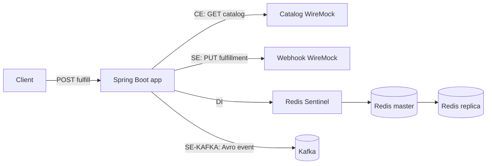

# Resilience Golden Demo

[](https://github.com/RudsonCarvalho/craft-audit/blob/main/corpus/resilience-golden-demo/audit.json)


> Positive-control fixture for the [CRAFT structural resilience audit](https://github.com/RudsonCarvalho/craft-audit).  
> The published score is traceable to audited commit [`c1cbfbc`](https://github.com/RudsonCarvalho/resilience-golden-demo/commit/c1cbfbcfdf3c8e503387807792af522ab42e7681) and its [evidence ledger](https://github.com/RudsonCarvalho/craft-audit/blob/main/corpus/resilience-golden-demo/audit.json).

A deliberately microscopic Java/Spring Boot service built to make structural resilience mechanisms explicit, executable, and independently auditable.

This is a **reference fixture**, not a production starter kit. Its job is to provide a known positive control for CRAFT/MS-1.1.1: if an auditor stops detecting a mechanism that is intentionally present here, that regression becomes visible.

## What it demonstrates

There is one application, one business capability, and one public route:

```text
POST /api/orders/{orderId}/fulfill
```

The fulfillment flow crosses every CRAFT vertical used by the active profile:

| CRAFT vertical | Interaction point | Protections demonstrated |
|---|---|---|
| **External Entry (EE)** | HTTP entry | semaphore bulkhead |
| **External Consultation (CE)** | synchronous catalog lookup | timeout, pool, circuit breaker, fallback, exponential retry + jitter + cap, global retry budget |
| **External Exit (SE)** | fulfillment webhook | timeout, pool, circuit breaker, fallback, retry, idempotent `PUT` + `Idempotency-Key`, gzip, bounded async dispatch |
| **Internal Data (DI)** | Redis order state | master/replica, Sentinel, timeout, pool, local fallback |
| **Application Container (AC)** | Spring/Kubernetes runtime | readiness, liveness, startup probe, self-healing, graceful shutdown, requests+limits, PDB |
| **Event Publishing (SE-KAFKA)** | Kafka fulfillment event | Avro validation, explicit bounded failure path, throttling, producer idempotence, bounded batch, `acks=all` |

[`CRAFT-MAP.md`](CRAFT-MAP.md) is the navigation map for the fixture. It is **not** scoring evidence: a compliant CRAFT audit must independently resolve each mechanism from source/configuration before awarding points.

## Architecture



The Java code uses a deliberately small Clean/Hexagonal-style structure:

```text
domain       -> business concepts only
application  -> use-case orchestration + outbound ports
infra        -> HTTP, Redis, Kafka, health, resilience and runtime configuration
```

Dependency direction matters here. `FulfillmentService` depends on `CatalogPort`, `OrderStatePort`, `FulfillmentWebhookPort`, and `FulfillmentEventPort`; the concrete adapters live under `infra`. The application layer therefore does not depend directly on `RestClient`, Redis, Kafka, or Resilience4j annotations.

The package layout also makes the CRAFT boundary visible:

```text
infra/entrypoint/web      -> External Entry
infra/client/catalog      -> External Consultation
infra/client/webhook      -> External Exit
infra/persistence/redis   -> Internal Data
infra/messaging/kafka     -> Event Publishing
infra/health + k8s        -> Application Container
```

## External dependencies

The demo intentionally uses real network boundaries:

- **Catalog WireMock** — synchronous consultation dependency.
- **Webhook WireMock** — outbound write dependency.
- **Redis master + replica + 3 Sentinels** — service-owned data dependency.
- **Kafka** — asynchronous event-publishing dependency.

The two WireMock containers are deterministic test doubles for systems outside the application boundary. They can be stopped on demand to demonstrate retry, circuit breaker, and fallback behavior without relying on an Internet service.

## Requirements

Complete demo:

- Docker with Docker Compose v2
- `curl`

Java-only development:

- Java 21
- Maven 3.9+

The Docker build is multi-stage, so Maven does not need to be installed on the host to run the full demo.

## Quick start

```bash
git clone https://github.com/RudsonCarvalho/resilience-golden-demo.git
cd resilience-golden-demo
docker compose up -d --build
./scripts/smoke-test.sh
```

A healthy response looks like:

```json
{
  "orderId": "craft-smoke-001",
  "catalogSource": "catalog-mock",
  "stateSource": "redis",
  "webhookStatus": "DISPATCHED",
  "kafkaStatus": "PUBLISHING"
}
```

The smoke test does more than check port 8080: it waits for real readiness, calls the fulfillment route twice, proves Redis read-back, and queries both WireMock admin APIs to verify that the two outbound HTTP integrations were actually exercised.

Stop everything with:

```bash
docker compose down -v
```

## Call the API manually

```bash
curl -X POST http://localhost:8080/api/orders/order-123/fulfill
```

The WireMock admin endpoints are exposed for inspection:

```bash
curl http://localhost:8081/__admin/requests
curl http://localhost:8082/__admin/requests
```

## Demonstrate dependency failure

With the stack running:

```bash
./scripts/failure-demo.sh
```

The script stops `catalog-mock` and `webhook-mock`, invokes the business route several times, verifies that the synchronous catalog call resolves through a local fallback, prints Resilience4j circuit-breaker/retry state, and restores the mocks automatically.

The degraded response exposes the fallback directly:

```json
"catalogSource": "fallback-local"
```

## Health and Kubernetes probes

The application exposes three distinct probe concepts:

```text
/actuator/health/startup
/actuator/health/readiness
/actuator/health/liveness
```

They are not static success endpoints:

- **startup** becomes UP after `ApplicationReadyEvent`;
- **readiness** executes a real Redis `PING`;
- **liveness** evaluates the bounded outbound executor and can return DOWN when that runtime component is terminated.

[`k8s/deployment.yaml`](k8s/deployment.yaml) adds distinct startup/readiness/liveness probes, `restartPolicy: Always`, graceful termination, `preStop`, resource requests and limits, two replicas, and a `PodDisruptionBudget`.

## External Consultation — catalog

`CatalogHttpClient` implements `CatalogPort` and performs:

```text
GET /catalog/{orderId}
```

The interaction has:

- pooled Apache HttpClient;
- 200 ms connect timeout;
- 700 ms response/socket timeout;
- 150 ms connection-request timeout;
- circuit breaker;
- local fallback;
- maximum 3 attempts;
- exponential backoff;
- randomized jitter;
- maximum retry wait of 500 ms;
- shared global retry token bucket.

Because the operation is `GET`, retry does not introduce non-idempotent-write risk.

## External Exit — webhook

`FulfillmentWebhookHttpClient` implements `FulfillmentWebhookPort` and performs:

```text
PUT /fulfillments/{orderId}
```

It uses pooled HTTP connections, explicit timeouts, circuit breaker, local fallback, bounded retry, global retry budget, idempotent `PUT` semantics plus an explicit `Idempotency-Key`, gzip compression, and asynchronous dispatch through a bounded executor:

```text
core threads = 2
max threads = 4
queue capacity = 16
```

## Internal Data — Redis

`RedisOrderStateAdapter` implements `OrderStatePort` through Spring Data Redis/Lettuce. The repository provides explicit evidence for one Redis master, one replica, three Sentinels, connect/command/pool-wait timeouts, pool limits, and a process-local fallback.

The fallback does not call Redis again, avoiding a circular fallback path.

## Event Publishing — Kafka

`KafkaFulfillmentEventPublisher` implements `FulfillmentEventPort` and publishes to:

```text
fulfillment-events
```

`OrderEventAvroEncoder` validates/encodes every event against a concrete Avro schema. Producer configuration explicitly declares:

```text
acks = all
enable.idempotence = true
batch.size = 16384
max.in.flight.requests.per.connection = 5
```

A Resilience4j rate limiter provides producer throttling. Failed sends are recorded in a bounded local failure buffer instead of being recursively sent back to the same failing Kafka backend.

## Global retry budget

The catalog and webhook retries share `GlobalRetryBudgetPredicate`:

```text
capacity = 20 tokens
refill = 10 tokens/second
```

That prevents multiple downstream retry policies from independently multiplying incident traffic.

## Anti-patterns intentionally avoided

| CRAFT penalty | How the fixture avoids it |
|---|---|
| Timeout inversion | outbound timeouts are explicit; there is no shorter in-repo caller timeout wrapping them |
| Unconditional liveness | liveness executes runtime logic and can fail |
| Circular fallback | fallbacks are local and do not target the failed/shared backend |
| Inert circuit breaker | 10-call window, minimum 5 calls, 50% threshold |
| Retry without backoff/cap | 3-attempt cap + exponential/randomized wait + max wait |
| Retry over non-idempotent write | consultation is GET; webhook is PUT + `Idempotency-Key` |
| Pool without timeout | HTTP and Redis pools are paired with explicit timeouts |

## Compile and test

```bash
mvn clean verify
```

For the full integration validation:

```bash
docker compose up -d --build
./scripts/smoke-test.sh
./scripts/failure-demo.sh
docker compose down -v
```

## Continuous integration

`.github/workflows/ci.yml` intentionally verifies two different things:

1. **maven-verify** — Java compilation, Spring context creation, probe tests, gzip and Avro tests.
2. **compose-smoke** — image build, complete stack startup, healthy-path integration, and dependency-failure behavior.

A green workflow therefore proves considerably more than syntax or application startup.

## Run a CRAFT audit

Use the [CRAFT audit skill](https://github.com/RudsonCarvalho/craft-audit) with profile **CRAFT/MS-1.1.1** and point it at this repository.

A compliant auditor should independently discover one deployable service and six interaction points. The expected positive-control result is:

```text
Resilience Score = 10.0
Classification   = Excelente
Penalties        = 0
D                = 1
```

The last published independent audit is stored in the CRAFT corpus at [`corpus/resilience-golden-demo/audit.json`](https://github.com/RudsonCarvalho/craft-audit/blob/main/corpus/resilience-golden-demo/audit.json). It is tied to the commit recorded inside that ledger; future code changes should be re-audited before updating the badge's provenance.

## Configuration reference

| Environment variable | Docker default | Purpose |
|---|---|---|
| `CATALOG_BASE_URL` | `http://catalog-mock:8080` | external consultation target |
| `WEBHOOK_BASE_URL` | `http://webhook-mock:8080` | external-exit target |
| `REDIS_SENTINELS` | three Compose Sentinel hosts | internal-data topology |
| `KAFKA_BOOTSTRAP_SERVERS` | `kafka:19092` | event-publishing target |

## Repository layout

```text
.
├── .github/workflows/ci.yml
├── CRAFT-MAP.md
├── Dockerfile
├── compose.yaml
├── k8s/deployment.yaml
├── infra/                         # local demo infrastructure
│   ├── redis/
│   └── wiremock/
├── scripts/
│   ├── smoke-test.sh
│   └── failure-demo.sh
├── src/main/java/io/github/rudsoncarvalho/craft/
│   ├── ResilienceGoldenDemoApplication.java
│   ├── domain/
│   ├── application/
│   │   ├── port/out/
│   │   └── service/
│   └── infra/
│       ├── entrypoint/web/
│       ├── client/catalog/
│       ├── client/webhook/
│       ├── persistence/redis/
│       ├── messaging/kafka/
│       ├── health/
│       ├── resilience/
│       └── config/
├── src/main/resources/application.yml
└── src/test/java/io/github/rudsoncarvalho/craft/
```

## Technology

- Java 21
- Spring Boot 3.5.x
- Resilience4j 2.4.x
- Spring Data Redis / Lettuce
- Apache Kafka
- Apache Avro
- Apache HttpClient 5
- WireMock
- Docker Compose
- Kubernetes manifests

## Design principle

This repository optimizes for **auditability, architectural clarity, and explicit boundaries rather than cleverness**. Domain code stays framework-independent, application code owns the use case and ports, and infrastructure adapters contain the mechanisms that cross service boundaries.

CRAFT follows a provenance-first rule: if an auditor cannot resolve a mechanism and its effective value to source/configuration evidence, it should not receive credit. The fixture is organized to make that proof easy to inspect without making the business layer depend on the audit framework.
